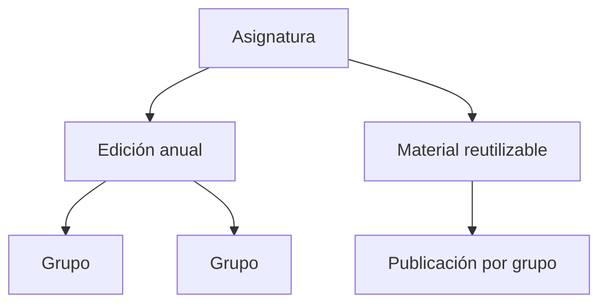
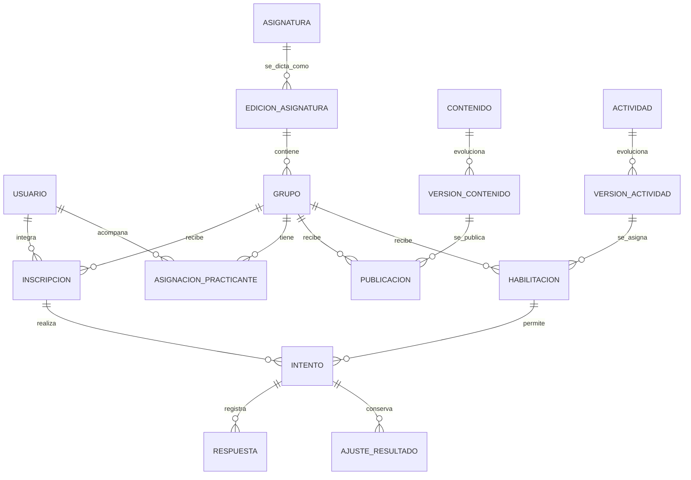
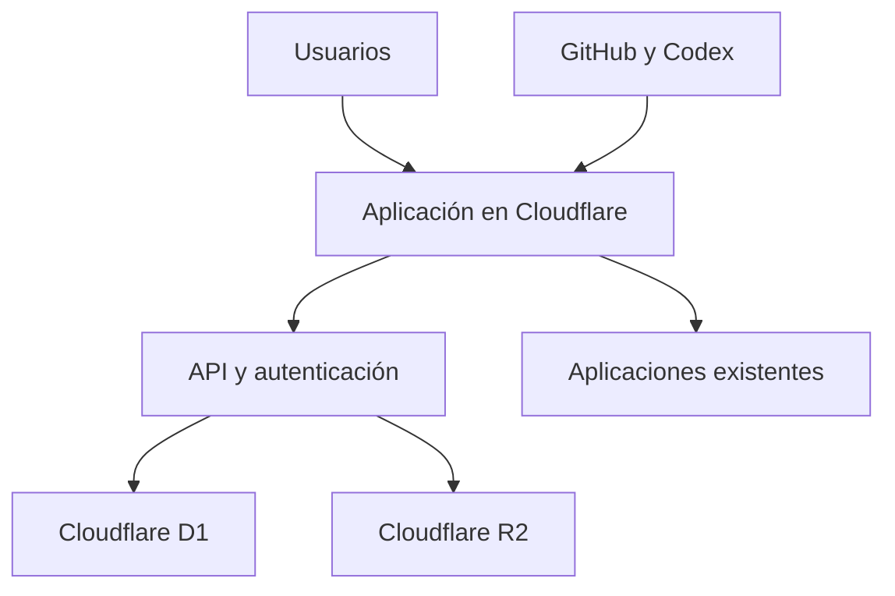

# Arquitectura base de profemacon.net 2.0

**Estado:** versión inicial de definición funcional y técnica  
**Fecha:** 20 de julio de 2026  
**Propósito:** guiar la construcción gradual de una plataforma educativa propia, alojada en Cloudflare, sin perder los proyectos y resultados que ya existen.

## 1. Visión

`profemacon.net` será el punto de entrada de un ecosistema educativo para estudiantes y practicantes. Reunirá materiales, cursos, actividades y seguimiento formativo bajo una sola identidad de usuario.

No se parte de cero: ya existen dos núcleos de actividades con lógica y resultados propios. La nueva plataforma los centralizará gradualmente, preservando sus enlaces, mecánicas y evidencias históricas.

El sitio podrá incorporar contenido público en el futuro, pero su primera finalidad es educativa y con acceso controlado.

## 2. Principios de diseño

1. **Una cuenta permanente por persona.** Un estudiante conserva su cuenta aunque cambie de grupo, asignatura o año.
2. **Evaluación formativa.** Se conservan todos los intentos, se muestran resultados y explicaciones, y se registra la mejora entre intentos.
3. **Materiales reutilizables.** Los contenidos se preparan una vez y se publican en una o varias ediciones anuales, sin duplicarlos.
4. **Seguridad y privacidad.** Se almacenan solamente los datos necesarios; las credenciales y archivos de estudiantes nunca se exponen públicamente.
5. **Migración sin interrupciones.** Las aplicaciones actuales continúan funcionando hasta que cada integración esté probada.
6. **Extensibilidad.** Las actividades nuevas no obligan a rediseñar la base de datos ni a modificar resultados anteriores.
7. **Control docente.** La publicación de contenido puede realizarse con Codex y Git; las tareas cotidianas de cursos, inscripciones, habilitaciones y resultados se resuelven en un panel operativo.

## 3. Sistemas existentes

| Sistema | Dirección actual | Función | Situación en la migración |
|---|---|---|---|
| Hub de actividades PM | `actividades.profemacon.net` | Cuestionarios y evaluaciones de Programación y Programación Avanzada | Se conserva y se enlaza desde la plataforma hasta migrar su identidad y API. |
| Resultados PM | `resultados.profemacon.net` | Consulta docente de intentos y resultados del hub | Se reemplazará gradualmente por el panel docente central. |
| Actividades Liceo | `actividades-liceo.profemacon.net` | Juegos de algoritmia de 7.º; futura programación por bloques | Se conserva y se integra primero como módulo de Ciencias de la Computación. |
| Nueva plataforma | `profemacon.net` | Cuentas, cursos, materiales, permisos, catálogo, habilitaciones y resultados unificados | Se construye en Cloudflare. |

### 3.1. Inventario pedagógico inicial

**Actividades Liceo** ya dispone de actividades de patrones, ordenamiento de botellas, candados, almacén, radar y criptografía. Se alinea directamente con el tramo de pensamiento computacional y algoritmia de 7.º, y será el lugar natural para incorporar programación en bloques.

**Hub de actividades PM** ya dispone de actividades de variables, condicionales, evaluaciones con intentos y actividades de análisis orientado a objetos. Se alinea con Programación I y Programación Avanzada.

## 4. Usuarios y permisos

| Acción | Administrador/docente | Practicante | Estudiante | Público futuro |
|---|---:|---:|---:|---:|
| Ver materiales publicados de sus cursos | Sí | Sí | Sí | Solo públicos |
| Ver materiales no publicados | Sí | Solo los grupos asignados | No | No |
| Probar actividades | Sí | Sí, en modo de prueba | Solo cuando estén habilitadas | No inicialmente |
| Crear o editar contenidos | Sí, por Git/Codex | No | No | No |
| Crear cursos, grupos y códigos | Sí | No | No | No |
| Aprobar inscripciones | Sí | No | No | No |
| Habilitar actividades, fechas e intentos | Sí | No | No | No |
| Ver resultados | Todos | Solo grupos asignados | Solo los propios | No |
| Ajustar resultados y dejar devolución | Sí | No inicialmente | No | No |
| Gestionar usuarios y roles | Sí | No | No | No |

Un practicante se asigna explícitamente a uno o más grupos. Su alcance no depende de la asignatura general sino de esas asignaciones concretas.

## 5. Organización académica

La estructura separa lo reutilizable de lo que cambia cada año:

| Nivel | Ejemplo | Vida útil |
|---|---|---|
| Asignatura | Programación | Permanente |
| Edición anual | Programación 2026 | Se archiva al finalizar el año |
| Grupo | 1.º MF | Pertenece a una edición anual |
| Material | Variables y entrada de datos | Reutilizable |
| Publicación | Material habilitado para 1.º MF | Configurable por año y grupo |

Un estudiante puede integrar varios grupos o asignaturas el mismo año. Por ejemplo, Programación y Sistemas Operativos en 1.º; Programación Avanzada y Bases de Datos en 2.º.

## 6. Ciclo de vida del estudiante

1. Se importa una lista inicial o el estudiante solicita unirse mediante un código de grupo.
2. El sistema crea o identifica la cuenta permanente.
3. La inscripción queda pendiente cuando se usa un código y el docente la aprueba.
4. El estudiante recibe un usuario estable y una contraseña temporal única; el primer inicio de sesión exige cambiarla.
5. Puede asociar y verificar un correo para recuperar el acceso.
6. Al finalizar el año, las inscripciones se archivan: conserva sus materiales, intentos y resultados en modo de solo lectura.

El nombre de usuario no incluye el grupo porque este cambia. Formato sugerido: `nombre.apellido`; ante una coincidencia se agrega un sufijo, por ejemplo `nombre.apellido2`.

## 7. Actividades y evaluación

### 7.1. Primera beta

- Opción múltiple.
- Verdadero/falso.
- Respuesta breve autocorregible.
- Actividades web existentes, inicialmente enlazadas y luego integradas.

Cada habilitación define grupos destinatarios, fecha de apertura, cierre, cantidad máxima de intentos, visibilidad de resultados y estado. El estado puede ser borrador, programada, abierta, cerrada o archivada.

### 7.2. Resultados formativos

Tras entregar una actividad, normalmente el estudiante verá:

- Puntaje.
- Sus respuestas.
- Respuestas correctas.
- Explicación o retroalimentación por pregunta.

Cada intento se conserva por separado. El sistema no reemplaza el primero por el segundo y puede mostrar la mejora entre ambos.

### 7.3. Ajustes manuales

Los ajustes docentes no modifican ni eliminan la evidencia original. Se guardan como una revisión separada con puntaje automático original, nuevo resultado, motivo, devolución, fecha y autor.

### 7.4. Tipos futuros previstos

| Tipo | Necesidad adicional |
|---|---|
| Respuesta abierta con IA | Revisión docente, transparencia de la corrección, control de costos y registro de la intervención de IA. |
| Código Python o Java | Entorno de ejecución aislado y seguro, casos de prueba y límites de recursos. |
| Archivo adjunto | Almacenamiento privado, metadatos de entrega y corrección manual. |
| Video, incluyendo respuestas en LSA | Almacenamiento privado, permisos estrictos, políticas de conservación y descarga controlada. |
| Rúbrica | Criterios, niveles, ponderaciones y devoluciones. |

## 8. Modelo conceptual de datos

Entidades esenciales:

- `usuario`, `rol` y `usuario_rol`.
- `asignatura`, `edicion_asignatura`, `grupo` e `inscripcion`.
- `asignacion_practicante` y códigos de inscripción.
- `contenido`, `version_contenido` y `publicacion`.
- `actividad`, `version_actividad`, `pregunta` e `habilitacion`.
- `intento`, `respuesta`, `resultado` y `ajuste_resultado`.
- `archivo` para objetos de R2.
- `auditoria` para operaciones importantes.
- `identidad_heredada` para relacionar IDs de los sistemas actuales con el nuevo usuario permanente durante la transición.

Las versiones de contenidos y actividades son obligatorias: un cambio realizado en 2027 no puede modificar lo que un estudiante realizó en 2026.

## 9. Arquitectura técnica propuesta

| Componente | Función |
|---|---|
| Cloudflare Pages / Workers | Interfaz, API, sesiones, permisos, reglas de actividades y despliegue. |
| Cloudflare D1 | Base relacional de la nueva plataforma. |
| Cloudflare R2 | Documentos, imágenes, entregas de archivos y, en una etapa posterior, video. |
| GitHub | Código, archivos de contenido y control de versiones. |
| Codex | Preparación, formato, revisión y publicación de materiales en el repositorio. |
| YouTube | Videos educativos embebidos. |
| Neon y Vercel actuales | Servicios temporales de los dos sistemas existentes hasta su migración. |

La decisión definitiva de migrar los datos de Neon a D1 se toma después de diseñar y probar el esquema de migración. Durante la beta, las aplicaciones existentes no deben perder acceso a sus bases ni a sus resultados.

## 10. Rutas iniciales

| Ruta | Función |
|---|---|
| `/` | Inicio y presentación de la plataforma. |
| `/ingresar` | Inicio de sesión. |
| `/recuperar-acceso` | Recuperación mediante correo verificado. |
| `/mis-cursos` | Panel del estudiante o practicante. |
| `/curso/:edicion/:grupo` | Materiales y actividades de un grupo. |
| `/actividad/:slug` | Ficha de una actividad; redirección o integración según su estado de migración. |
| `/historial` | Cursos archivados, resultados y materiales de solo lectura. |
| `/docente` | Panel docente: grupos, habilitaciones, resultados e inscripciones. |
| `/practicante` | Vista limitada a los grupos asignados. |

## 11. Plan de construcción

### Etapa 0 - Preparación y resguardo

- Separar secretos y datos personales del código fuente.
- Mantener archivos `.env` fuera de Git y conservar solo `.env.example`.
- Rotar credenciales que hayan quedado incluidas en archivos compartidos.
- Inventariar actividades, URLs, bases y resultados existentes.

### Etapa 1 - Núcleo de la plataforma

- Crear el repositorio de `profemacon.net`.
- Implementar diseño base, navegación y catálogo de materiales.
- Implementar cuentas, sesiones, roles, cursos, grupos e inscripciones.
- Implementar panel docente mínimo.

### Etapa 2 - Actividades controladas

- Publicar cuestionarios nativos de la beta.
- Configurar fechas, intentos y devolución.
- Registrar resultados y ajustes manuales.
- Importar inicialmente estudiantes y grupos desde listas controladas.

### Etapa 3 - Puente con sistemas actuales

- Registrar cada actividad heredada en el catálogo central.
- Enlazarla desde los cursos correctos.
- Crear equivalencias entre identidades y resultados heredados.
- Migrar un sistema piloto antes de modificar los demás.

### Etapa 4 - Integración gradual

- Integrar primero Actividades Liceo, incluyendo programación por bloques.
- Unificar resultados del Hub PM en el panel central.
- Retirar `resultados.profemacon.net` solo cuando sus funciones estén cubiertas y validadas.

### Etapa 5 - Capacidades futuras

- Rúbricas, entregas, archivos, video y respuestas abiertas asistidas por IA.
- Entornos seguros de ejecución de Python y Java.
- Catálogo público de recursos seleccionados.

## 12. Criterios de éxito de la beta

La beta estará lista para uso real cuando un estudiante pueda iniciar sesión, entrar a sus cursos, consultar materiales y realizar una actividad habilitada; cuando el docente pueda aprobar una inscripción, configurar una actividad y consultar todos los intentos; y cuando un practicante pueda consultar los materiales y resultados de los grupos asignados sin obtener permisos de edición.

## 13. Decisiones pendientes antes de programar la base

1. Nombre y formato definitivo de las asignaturas y ediciones de 2026.
2. Estrategia de migración de identidades y resultados desde cada base Neon existente.
3. Política de conservación de archivos y video.
4. Diseño visual de la portada y del panel de cursos.
5. Tecnología de interfaz y biblioteca de autenticación compatibles con Cloudflare Workers.

