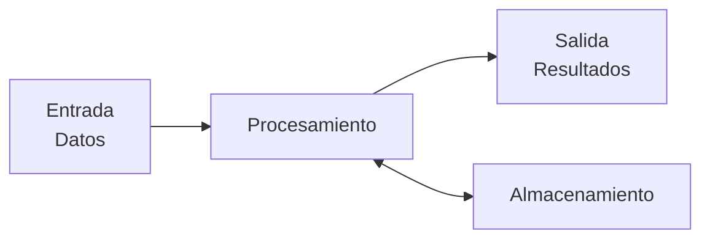
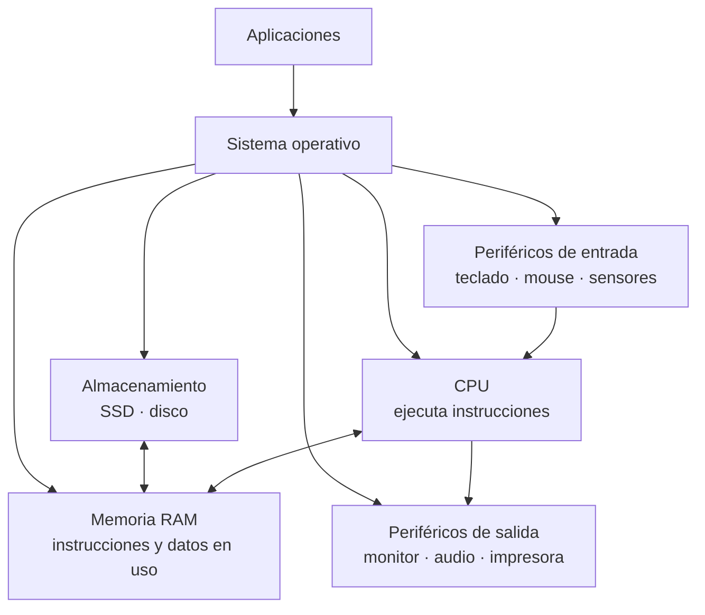
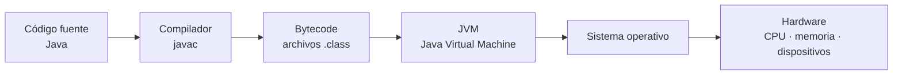

# Unidad 0 — Introducción a la programación

## ¿Qué vamos a comprender en esta unidad?

Antes de escribir programas necesitamos entender una idea fundamental:

> **Una computadora no interpreta nuestras intenciones. Ejecuta instrucciones según reglas precisas.**

Cuando usamos una aplicación, un videojuego, un navegador o un sistema de gestión, detrás de lo que vemos existen instrucciones que finalmente son procesadas por el hardware.

En esta unidad estudiaremos cómo una computadora recibe y procesa información, cuál es el papel de la **CPU**, la **memoria** y el **software**, y por qué todo esto hace necesario que los programadores expresen las soluciones mediante **algoritmos precisos y ordenados**.

Esta base nos permitirá comprender más adelante por qué, al programar, el orden de las instrucciones importa y cómo aparecen estructuras que permiten **decidir**, **repetir** o modificar el orden normal de ejecución.

---

# 1. ¿Qué es la informática?

La **informática** estudia el tratamiento automático de la información mediante sistemas computacionales.

Esto incluye mucho más que utilizar computadoras.

La informática se ocupa, entre otras cosas, de:

- representar información;
- almacenar y recuperar datos;
- diseñar algoritmos;
- automatizar tareas;
- desarrollar software;
- procesar grandes cantidades de datos;
- controlar dispositivos;
- comunicar sistemas;
- resolver problemas mediante procedimientos computacionales.

Por ejemplo, un sistema informático puede utilizarse para:

- gestionar las reservas de un hotel;
- calcular una ruta;
- controlar un robot industrial;
- registrar las ventas de un comercio;
- procesar imágenes médicas;
- organizar información de estudiantes;
- analizar datos meteorológicos.

En todos estos casos existe un problema que requiere **datos**, algún tipo de **procesamiento** y un **resultado**.

> **Idea clave**
>
> La computadora es una herramienta capaz de ejecutar procesos automáticos sobre información.  
> Para que pueda hacerlo, alguien debe establecer qué operaciones se realizarán y en qué condiciones.

---

# 2. Hardware y software

Un sistema informático combina dos componentes fundamentales.

## Hardware

El **hardware** es el conjunto de componentes físicos de un sistema computacional.

Ejemplos:

- CPU o procesador;
- memoria RAM;
- placa madre;
- unidades SSD o discos;
- teclado;
- monitor;
- cámara;
- micrófono;
- impresora.

## Software

El **software** está formado por los programas y datos que permiten utilizar el hardware para realizar determinadas tareas.

Ejemplos:

- sistemas operativos;
- navegadores;
- videojuegos;
- procesadores de texto;
- aplicaciones móviles;
- programas desarrollados por nosotros.

Hardware y software funcionan de forma conjunta.

Un procesador puede ejecutar instrucciones, pero necesita recibir esas instrucciones mediante programas. A su vez, un programa necesita hardware donde almacenarse y ejecutarse.

> **No son sistemas independientes**
>
> El software expresa qué operaciones deben realizarse.  
> El hardware proporciona los mecanismos físicos para ejecutarlas.


**Fuente:** Wikimedia Commons  
**Página del archivo:** https://commons.wikimedia.org/wiki/File:Personal_computer,_exploded_4.svg  
**Licencia/condiciones:** consultar la licencia y atribución indicadas en la ficha del archivo antes de reutilizarla.

---

# 3. Entrada, procesamiento, salida y almacenamiento

Muchos sistemas informáticos pueden analizarse inicialmente mediante cuatro funciones:

1. **Entrada**
2. **Procesamiento**
3. **Salida**
4. **Almacenamiento**

## Entrada

La entrada proporciona datos al sistema.

Algunos dispositivos de entrada son:

- teclado;
- mouse;
- pantalla táctil;
- micrófono;
- cámara;
- sensores.

También pueden existir entradas que no provienen directamente de una persona, como:

- datos recibidos por una red;
- información leída desde un archivo;
- mediciones de sensores.

## Procesamiento

Durante el procesamiento se realizan operaciones sobre los datos.

Por ejemplo:

- sumar valores;
- comparar números;
- buscar información;
- ordenar datos;
- decidir qué acción realizar;
- transformar una imagen;
- calcular una ruta.

La **CPU** participa directamente en la ejecución de las instrucciones necesarias para realizar estas operaciones.

## Salida

La salida comunica o produce el resultado del procesamiento.

Puede aparecer mediante:

- un monitor;
- una impresora;
- parlantes;
- una señal enviada a otro dispositivo;
- información enviada por una red.

## Almacenamiento

El almacenamiento permite conservar programas y datos para utilizarlos posteriormente.

Ejemplos:

- SSD;
- discos duros;
- memorias flash;
- tarjetas de memoria.

### Modelo básico



Este modelo es útil para comenzar a analizar un problema.

Por ejemplo, en un sistema que calcula el precio final de una compra:

- **entrada:** precios y cantidades;
- **procesamiento:** cálculos correspondientes;
- **salida:** total a pagar;
- **almacenamiento:** eventualmente guardar la venta.

---

# 4. CPU, memoria RAM y almacenamiento

Estos tres componentes cumplen funciones diferentes.

## CPU

La **CPU** (*Central Processing Unit*, Unidad Central de Procesamiento) ejecuta las instrucciones de los programas.

Entre sus tareas se encuentran:

- realizar operaciones aritméticas;
- realizar operaciones lógicas;
- mover datos;
- comparar valores;
- controlar el orden de ejecución de las instrucciones.

La CPU no recibe normalmente una descripción humana del problema como:

> “Calculá el promedio de las notas y avisame si el estudiante aprobó”.

Debe ejecutar una secuencia concreta de instrucciones mucho más elementales.

## Memoria RAM

La **RAM** es la memoria principal de trabajo del sistema.

Cuando un programa está ejecutándose, tanto sus instrucciones como muchos de los datos que necesita se encuentran disponibles en memoria.

La RAM permite acceder rápidamente a la información, pero normalmente es **volátil**:

> al interrumpirse la alimentación eléctrica, su contenido no se conserva.

Esto la diferencia del almacenamiento permanente.

## Almacenamiento

Los dispositivos de almacenamiento, como SSD o discos, conservan información de manera persistente.

Allí pueden encontrarse:

- el sistema operativo;
- programas;
- documentos;
- imágenes;
- bases de datos.

Cuando ejecutamos un programa, el sistema operativo carga en memoria la información necesaria para poder ejecutarlo.

## Relación entre los componentes



Este esquema es conceptual. En una computadora real existen buses, controladores, memorias caché y numerosos componentes intermedios.

Por ahora nos interesa una relación fundamental:

> **La CPU necesita instrucciones y datos disponibles en memoria para poder trabajar con ellos.**

---

# 5. ¿Cómo ejecuta instrucciones una CPU?

Una CPU moderna es extremadamente compleja. Puede utilizar varios núcleos, memorias caché, ejecución paralela, predicción de saltos y otras técnicas.

Sin embargo, para comprender los fundamentos de programación podemos estudiar un **modelo conceptual del ciclo de instrucción**.

La idea básica es:

1. localizar la próxima instrucción;
2. buscarla;
3. decodificarla;
4. ejecutarla;
5. continuar con la siguiente.

## 5.1 El contador de programa

La CPU necesita saber **qué instrucción corresponde ejecutar**.

Para ello existe conceptualmente un registro llamado **contador de programa**, conocido habitualmente como:

**PC — Program Counter**

El PC contiene una referencia a la próxima instrucción que debe procesarse.

Podemos imaginar un programa almacenado de esta manera:

```text
Dirección 100 → instrucción A
Dirección 101 → instrucción B
Dirección 102 → instrucción C
Dirección 103 → instrucción D
```

Si el contador de programa indica `100`, la CPU sabe que debe comenzar obteniendo la instrucción correspondiente a esa posición.

---

# 6. El ciclo buscar → decodificar → ejecutar

## 6.1 Búsqueda — Fetch

La CPU consulta la memoria para obtener la instrucción indicada por el contador de programa.

Este paso suele llamarse **fetch**, que podemos traducir como búsqueda u obtención de la instrucción.

## 6.2 Decodificación — Decode

Una instrucción almacenada en memoria está codificada.

La CPU debe determinar:

- qué operación representa;
- qué datos necesita;
- dónde se encuentran esos datos;
- qué componentes internos deberán intervenir.

Por ejemplo, una instrucción podría representar conceptualmente:

```text
SUMAR
```

mientras otra podría representar:

```text
COMPARAR
```

o:

```text
SALTAR A OTRA INSTRUCCIÓN
```

## 6.3 Ejecución — Execute

Una vez interpretada la instrucción, la CPU realiza la operación correspondiente.

La acción puede implicar:

- realizar un cálculo;
- comparar valores;
- mover información;
- leer o modificar memoria;
- alterar el flujo de ejecución.

## 6.4 Siguiente instrucción

Normalmente el contador de programa avanza para señalar la instrucción siguiente.

El ciclo comienza nuevamente.


Este proceso ocurre continuamente mientras la CPU ejecuta instrucciones.

> **Modelo fundamental**
>
> La ejecución normal sigue una secuencia de instrucciones, pero esa secuencia puede modificarse mediante instrucciones especiales de salto.

---

# 7. La ejecución no siempre continúa en línea recta

Supongamos esta secuencia conceptual:

```text
100 → leer edad
101 → comparar edad con 18
102 → decidir qué camino seguir
103 → mostrar "Mayor de edad"
104 → ...
110 → mostrar "Menor de edad"
```

Después de comparar la edad, la CPU podría ejecutar una instrucción que cambie el valor del contador de programa.

Por ejemplo:

```text
Si edad < 18 → continuar en la instrucción 110
```

Eso modifica el recorrido normal.

Esta capacidad permite construir:

- decisiones;
- repeticiones;
- llamadas a otras partes de un programa.

Más adelante veremos estas ideas mediante estructuras como:

```text
if
while
for
```

Pero todas ellas terminan representándose, en niveles inferiores, mediante instrucciones capaces de controlar el flujo de ejecución.

> **Una computadora no está obligada a ejecutar siempre la instrucción físicamente siguiente.**
>
> Puede modificar cuál será la próxima instrucción mediante operaciones de control.

---

# 8. ¿Por qué importa tanto el orden de las instrucciones?

Consideremos estas acciones:

```text
1. Mostrar el resultado.
2. Pedir dos números.
3. Sumar los números.
```

Las tres acciones podrían ser correctas individualmente.

Sin embargo, el orden no permite resolver correctamente el problema.

Un orden lógico sería:

```text
1. Pedir el primer número.
2. Pedir el segundo número.
3. Sumarlos.
4. Mostrar el resultado.
```

La computadora ejecuta instrucciones según la estructura que le proporcionemos.

No puede asumir que:

> “seguramente el programador quería sumar antes de mostrar”.

Esto conduce a una idea central de la programación:

> **Resolver un problema computacional exige describir una secuencia precisa de acciones.**

---

# 9. De un problema a un algoritmo

Antes de escribir código conviene pensar la solución.

Supongamos el problema:

> Calcular el precio total de una compra conociendo el precio de un producto y la cantidad comprada.

Podríamos expresar la solución:

```text
PEDIR precio
PEDIR cantidad
CALCULAR total = precio × cantidad
MOSTRAR total
```

Todavía no estamos utilizando Java.

Estamos describiendo una solución mediante instrucciones comprensibles.

Eso es una forma sencilla de representar un **algoritmo**.

---

# 10. ¿Qué es un algoritmo?

Un **algoritmo** es una secuencia organizada de instrucciones que permite resolver un problema o realizar una tarea.

No todo conjunto de instrucciones constituye automáticamente un buen algoritmo.

Debe cumplir determinadas propiedades.

## 10.1 Finito y realizable

El algoritmo debe poder completar su tarea en una cantidad finita de pasos para los casos previstos y cada operación indicada debe poder realizarse.

## 10.2 Preciso

Las instrucciones deben indicar claramente qué debe hacerse.

## 10.3 Comprensible

La representación del algoritmo debe permitir que podamos leerlo, analizarlo, comprobarlo, comunicarlo y transformarlo posteriormente en un programa.

## 10.4 Determinista

En el sentido introductorio que utilizaremos en este curso, diremos que un algoritmo es **determinista** cuando, dadas las mismas condiciones y datos de entrada, sus reglas determinan el mismo proceso y resultado.

> **Algoritmo**
>
> Una solución expresada mediante pasos precisos, ordenados y realizables.

---

# 11. ¿Qué es un lenguaje de programación?

Un **lenguaje de programación** es un lenguaje formal diseñado para expresar instrucciones y estructuras que pueden ser procesadas mediante herramientas informáticas para construir programas.

Cada lenguaje define:

- símbolos;
- palabras reservadas;
- reglas sintácticas;
- tipos de construcciones;
- significado de esas construcciones.

No es simplemente “un idioma que entiende la computadora”.

Entre el código que escribe una persona y las instrucciones que finalmente ejecuta una CPU pueden existir varias etapas de traducción y ejecución.

---

# 12. Código de máquina

El **código de máquina** contiene instrucciones codificadas para una arquitectura de procesador determinada.

Habitualmente se representa mediante bits:

```text
0 y 1
```

Los bits representan estados físicos y codificaciones que los circuitos digitales pueden procesar.

---

# 13. Lenguaje ensamblador

El **lenguaje ensamblador** permite representar instrucciones de máquina mediante símbolos o nombres más manejables.

Conceptualmente podríamos encontrar instrucciones similares a:

```text
MOV
ADD
CMP
JMP
```

Un programa llamado **ensamblador** transforma esas instrucciones en código de máquina correspondiente a una arquitectura concreta.

---

# 14. Lenguajes de alto nivel

Los lenguajes de alto nivel permiten expresar soluciones utilizando abstracciones más cercanas a la forma en que las personas modelamos los problemas.

Ejemplos:

- Java;
- Python;
- C;
- C++;
- C#;
- JavaScript.

| Nivel | Característica principal |
|---|---|
| Código de máquina | Instrucciones codificadas para una arquitectura concreta |
| Ensamblador | Representación simbólica muy próxima a las instrucciones de máquina |
| Alto nivel | Mayor abstracción para expresar algoritmos y construir software |

---

# 15. ¿Dónde aparece Java?

En este curso utilizaremos **Java**, un lenguaje de programación de alto nivel.

Todavía no vamos a escribir programas.

Primero necesitamos comprender brevemente cómo pasa un programa escrito en Java a una forma que pueda ejecutarse.

---

# 16. Código fuente Java

Los programadores escriben **código fuente** utilizando las reglas del lenguaje Java.

Este código no es directamente el código de máquina del procesador.

---

# 17. Compilación

Una herramienta llamada **compilador** analiza el código fuente.

En Java, el compilador habitual transforma el código fuente en un formato intermedio denominado **bytecode**.

```text
Código Java
        ↓
Compilador
        ↓
Bytecode
```

---

# 18. ¿Qué es el bytecode?

El **bytecode** no es normalmente el código de máquina específico del procesador físico.

Es un conjunto de instrucciones definido para la **Java Virtual Machine**.

---

# 19. JVM — Java Virtual Machine

La **JVM**, o Máquina Virtual de Java, es el entorno abstracto de ejecución definido para ejecutar bytecode Java.

Una implementación concreta de la JVM se ejecuta sobre un sistema y una arquitectura determinados.

Durante la ejecución puede:

- cargar clases;
- verificar bytecode;
- interpretar instrucciones;
- compilar dinámicamente partes del programa a código nativo;
- administrar memoria y otros recursos de ejecución.

---

# 20. Del código Java hasta la computadora



Este modelo está simplificado, pero permite comprender una idea importante:

> **El código que escribe el programador no es necesariamente la misma representación que finalmente ejecuta físicamente la CPU.**

---

# 21. ¿Por qué utilizar esta estrategia?

Una ventaja fundamental del modelo de Java es separar el programa compilado de muchos detalles específicos del hardware y del sistema donde finalmente se ejecutará.

La idea puede resumirse así:

```text
Código Java
      ↓
Bytecode común
      ↓
JVM adecuada para cada plataforma
```

Esto favorece la **portabilidad**.

La formulación técnicamente más correcta es:

> **El diseño de Java permite que bytecode compatible pueda ejecutarse en distintas plataformas que dispongan de una implementación adecuada de la JVM y de los recursos necesarios.**

---

# 22. De la CPU al algoritmo: la conexión fundamental

```text
PROBLEMA
   ↓
ALGORITMO
   ↓
PROGRAMA EN UN LENGUAJE
   ↓
TRADUCCIÓN / EJECUCIÓN
   ↓
INSTRUCCIONES PROCESADAS POR EL SISTEMA
```

Este será el recorrido central de Programación I.

---

# 23. Imágenes sugeridas para ampliar el material

Estas imágenes son opcionales. Los diagramas didácticos principales de esta unidad están realizados en Mermaid para permitir su renderizado local.


**Fuente:** Wikimedia Commons  
**URL de la ficha:** https://commons.wikimedia.org/wiki/File:Personal_computer,_exploded_4.svg  
**Licencia/condiciones:** consultar la ficha del archivo para atribución y licencia exactas.


**Fuente:** Wikimedia Commons  
**URL de la ficha:** https://commons.wikimedia.org/wiki/File:Asus_Zenbook_UX31E_-_motherboard-48216.jpg  
**Licencia/condiciones:** consultar la ficha del archivo para atribución y licencia exactas.

.jpg)

**Fuente:** U.S. Army / ARL Technical Library, disponible mediante Wikimedia Commons  
**URL de la ficha:** https://commons.wikimedia.org/wiki/File:Two_women_operating_ENIAC_(full_resolution).jpg  
**Licencia/condiciones:** consultar la ficha del archivo para las condiciones exactas de reutilización.

---

# Actividad 0 — Comprobación de comprensión

## Pregunta 1

**Tipo:** Opción múltiple

**Enunciado:**  
Un programa se encuentra guardado en un SSD. Cuando comienza a ejecutarse, ¿qué descripción representa mejor lo que sucede?

**Opciones:**

A. La CPU ejecuta directamente todas las instrucciones desde el SSD sin utilizar memoria.  
B. El programa se transforma automáticamente en hardware.  
C. El sistema carga en memoria los elementos necesarios del programa y la CPU ejecuta sus instrucciones.  
D. La memoria RAM guarda permanentemente el programa aunque se apague el equipo.

**Respuesta correcta:** C

**Retroalimentación:**  
La RAM funciona como memoria de trabajo. El sistema carga allí las partes necesarias para la ejecución, mientras que el almacenamiento mantiene los datos de forma persistente.

## Pregunta 2

**Tipo:** Opción múltiple

**Enunciado:**  
¿Cuál es la función conceptual principal del contador de programa?

**Opciones:**

A. Guardar todos los resultados obtenidos por el programa.  
B. Indicar la próxima instrucción que debe procesarse.  
C. Traducir Java a bytecode.  
D. Controlar exclusivamente los dispositivos de entrada.

**Respuesta correcta:** B

**Retroalimentación:**  
El contador de programa participa en el control del flujo de ejecución al mantener una referencia a la próxima instrucción.

## Pregunta 3

**Tipo:** Opción múltiple

**Enunciado:**  
¿Por qué una CPU no tiene que ejecutar siempre la instrucción ubicada inmediatamente después de la actual?

**Opciones:**

A. Porque algunas instrucciones pueden modificar el flujo y hacer que la ejecución continúe en otra posición.  
B. Porque la CPU elige libremente qué instrucciones parecen más importantes.  
C. Porque todas las instrucciones se ejecutan simultáneamente.  
D. Porque el almacenamiento decide el orden del programa.

**Respuesta correcta:** A

**Retroalimentación:**  
Las instrucciones de salto o control permiten modificar cuál será la próxima instrucción.

## Pregunta 4

**Tipo:** Opción múltiple

**Enunciado:**  
¿Cuál representa mejor el proceso habitual de un programa Java compilado?

**Opciones:**

A. Java → sistema operativo → pseudocódigo → CPU.  
B. Java → ensamblador obligatorio → HTML → CPU.  
C. Java → código de máquina universal → CPU sin software intermedio.  
D. Código fuente Java → compilación → bytecode → JVM → ejecución sobre la plataforma.

**Respuesta correcta:** D

**Retroalimentación:**  
El compilador Java genera normalmente bytecode. Una JVM compatible procesa ese bytecode y permite su ejecución sobre una plataforma concreta.

## Pregunta 5

**Tipo:** Verdadero/Falso

**Enunciado:**  
La memoria RAM y el almacenamiento cumplen exactamente la misma función y conservan los datos de la misma manera.

**Respuesta correcta:** Falso

**Retroalimentación:**  
La RAM es principalmente memoria de trabajo rápida y volátil. SSD y discos se utilizan para almacenamiento persistente.

## Pregunta 6

**Tipo:** Verdadero/Falso

**Enunciado:**  
Durante el ciclo de instrucción, la CPU debe interpretar qué operación representa una instrucción antes de ejecutarla.

**Respuesta correcta:** Verdadero

**Retroalimentación:**  
Ese proceso corresponde conceptualmente a la etapa de **decodificación**.

## Pregunta 7

**Tipo:** Verdadero/Falso

**Enunciado:**  
Un algoritmo y un programa Java son necesariamente la misma cosa.

**Respuesta correcta:** Falso

**Retroalimentación:**  
El algoritmo describe una solución. Un programa Java es una posible implementación concreta de esa solución.

## Pregunta 8

**Tipo:** Completar una palabra o sigla

**Enunciado:**  
La sigla de la unidad que ejecuta las instrucciones de un computador es `_____`.

**Respuesta correcta:** CPU

**Retroalimentación:**  
CPU significa *Central Processing Unit*, o Unidad Central de Procesamiento.

## Pregunta 9

**Tipo:** Completar una palabra o sigla

**Enunciado:**  
La representación intermedia generada normalmente al compilar código Java se denomina `_____`.

**Respuesta correcta:** bytecode

**Retroalimentación:**  
El bytecode está diseñado para ser procesado por la Máquina Virtual de Java.

## Pregunta 10

**Tipo:** Completar una palabra o sigla

**Enunciado:**  
La sigla de *Java Virtual Machine* es `_____`.

**Respuesta correcta:** JVM

**Retroalimentación:**  
La JVM proporciona el entorno abstracto en el que se ejecuta el bytecode Java.

## Pregunta 11

**Tipo:** Correlación

**Enunciado:**  
Relacioná cada componente con su función principal.

**Elementos A:**

1. CPU
2. RAM
3. SSD
4. Teclado

**Elementos B:**

A. Entrada de datos  
B. Almacenamiento persistente  
C. Ejecución de instrucciones  
D. Memoria principal de trabajo

**Respuesta correcta:**

- 1 → C
- 2 → D
- 3 → B
- 4 → A

**Retroalimentación:**  
Cada componente cumple un papel diferente.

## Pregunta 12

**Tipo:** Correlación

**Enunciado:**  
Relacioná cada nivel o componente con su descripción.

**Elementos A:**

1. Código de máquina
2. Ensamblador
3. Lenguaje de alto nivel
4. Bytecode Java
5. JVM

**Elementos B:**

A. Entorno abstracto que procesa y ejecuta bytecode Java  
B. Representación intermedia utilizada por Java  
C. Instrucciones codificadas para una arquitectura de procesador  
D. Lenguaje que utiliza representaciones simbólicas cercanas a las instrucciones de máquina  
E. Lenguaje con mayor nivel de abstracción para expresar soluciones y construir programas

**Respuesta correcta:**

- 1 → C
- 2 → D
- 3 → E
- 4 → B
- 5 → A

**Retroalimentación:**  
Los lenguajes y representaciones se encuentran en distintos niveles.

## Pregunta 13

**Tipo:** Ordenar

**Enunciado:**  
Ordená conceptualmente los pasos básicos del ciclo de instrucción.

**Elementos desordenados:**

- Ejecutar la instrucción.
- Obtener la instrucción indicada.
- Determinar cuál será la próxima instrucción.
- Decodificar la instrucción.

**Respuesta correcta:**

1. Obtener la instrucción indicada.
2. Decodificar la instrucción.
3. Ejecutar la instrucción.
4. Determinar cuál será la próxima instrucción.

**Retroalimentación:**  
Este modelo suele resumirse como **buscar → decodificar → ejecutar**.

---

# Conexión con la Unidad 1

En esta unidad estudiamos **cómo funciona la ejecución**.

La próxima pregunta será:

> **¿Cómo diseñamos nosotros las instrucciones antes de escribirlas en Java?**


> **Programar no empieza escribiendo código.**
>
> Empieza comprendiendo un problema y diseñando una solución que pueda expresarse mediante instrucciones precisas.
