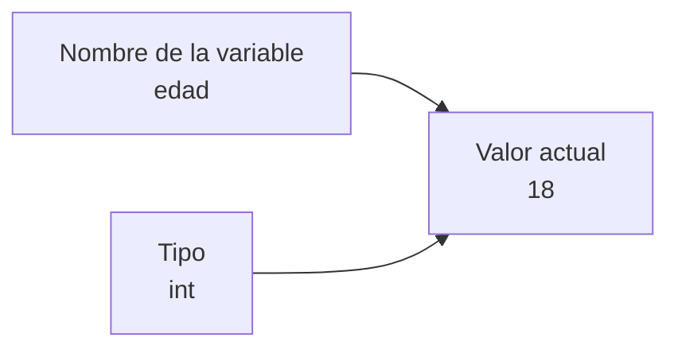
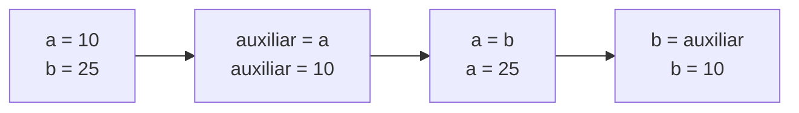

# Unidad 1 — Variables, tipos de datos y operadores

## Propósito de la unidad

En la Unidad 0 estudiamos que una computadora ejecuta instrucciones. Ahora comenzamos a escribir esas instrucciones en Java.

Para resolver problemas, un programa necesita **recordar datos**: una edad, una nota, una temperatura, un precio o el resultado parcial de una operación. Las **variables** nos permiten dar nombre a esos datos, indicar qué tipo de valor pueden almacenar y usarlos durante la ejecución del programa.

> **Idea central**
>
> Una variable es un nombre que usamos para trabajar con un valor guardado en memoria mientras se ejecuta el programa.

Esta unidad también presenta el entorno de trabajo, la salida por pantalla, las operaciones aritméticas y el intercambio de valores mediante una variable auxiliar. Es la base necesaria para las próximas unidades: entrada de datos, decisiones con `if`, repeticiones y estructuras de datos.

---

## Recorrido audiovisual y teórico

Cada video aparece dentro del material en el momento en que aporta una demostración o una explicación. No debe reemplazar la lectura: el estudiante primero encuentra el problema y los conceptos; después el video permite verlos en funcionamiento; por último, realiza una práctica breve.

| Momento | Video | Integra con | Propósito en la plataforma |
|---|---|---|---|
| 1 | [Entorno de trabajo, Java y primer programa](https://www.youtube.com/watch?v=iZTONYPJPs8) | Primer programa y estructura mínima | Ver la instalación y la ejecución real antes de escribir código. |
| 2 | [Qué son las variables](https://youtu.be/76xkPICOb8c?si=cEx1jNHixD5NxKdq) | Memoria, declaración, asignación y tipos | Consolidar la idea de “nombre + valor + tipo”. |
| 3 | [Operaciones aritméticas con variables](https://youtu.be/CbBvBZ9JSas?si=1jhqrB-hP3-ayCbD) | Expresiones, resultados y división | Pasar de guardar datos a calcular. |
| 4 | [Intercambio del valor de dos variables](https://youtu.be/fIWleE2f0tE?si=Z7nxOAx2Z30Aqwd0) | Algoritmos, trazado y variable auxiliar | Comprender por qué el orden de las instrucciones importa. |

---

# Clase 1 — Preparar el entorno y ejecutar un primer programa

## 1. ¿Qué necesitamos para programar en Java?

Para escribir y ejecutar programas Java necesitamos dos herramientas diferentes:

- un **editor o entorno de desarrollo**, donde escribimos el código;
- el **JDK** (*Java Development Kit*), que incluye las herramientas necesarias para compilar y ejecutar programas Java.

En esta unidad utilizaremos Visual Studio Code como editor. Es importante distinguir el editor del lenguaje: Visual Studio Code no “es Java”; nos ayuda a escribir archivos, mientras que el JDK procesa el programa Java.

> **Video 1 — Entorno de trabajo, Java y primer programa**
>
> Mirá el video antes o durante esta clase. Mientras lo ves, identificá: el archivo `.java`, la terminal, el comando de ejecución y el resultado mostrado por el programa.
>
> [Abrir video](https://www.youtube.com/watch?v=iZTONYPJPs8)

## 2. Un programa Java mínimo

```java
public class HolaMundo {
    public static void main(String[] args) {
        System.out.println("Hola, mundo");
    }
}
```

Por ahora no necesitamos memorizar cada palabra. Sí debemos reconocer dos ideas:

1. El programa comienza a ejecutarse dentro del método `main`.
2. `System.out.println(...)` muestra información en la consola y termina la línea.

### Secuencias de escape

Dentro de un texto entre comillas, `\n` representa un salto de línea.

```java
System.out.println("Bienvenido\na\nla programación\nen Java");
```

El carácter `\` avisa que viene una instrucción especial. La combinación `\n` no se imprime como dos caracteres: hace que la consola continúe en la línea siguiente.

### Práctica breve

Modificá el programa para que muestre tu nombre, el grupo y una frase en tres líneas distintas usando una única instrucción `println`.

---

# Clase 2 — Variables y tipos de datos

## 3. ¿Por qué necesitamos variables?

Un programa podría mostrar valores escritos directamente:

```java
System.out.println(18 + 7);
```

Pero así no podemos reutilizar, actualizar ni dar significado a los datos. En cambio, una variable permite trabajar con un valor identificado por un nombre:

```java
int edad = 18;
int anioActual = 2026;
int anioNacimiento = anioActual - edad;
```

En este ejemplo, `edad`, `anioActual` y `anioNacimiento` son nombres elegidos por quien programa. Cada nombre representa un dato que puede usarse más adelante.



> **Importante**
>
> Una variable no es “una caja” que el programa ve físicamente. Es un modelo útil para pensar que un nombre permite acceder a un valor durante la ejecución.

## 4. Declarar, inicializar y modificar

Estas tres acciones no son exactamente iguales:

```java
int cantidad;          // declaración
cantidad = 3;          // asignación o inicialización posterior
cantidad = cantidad + 1; // nuevo valor: ahora vale 4
```

La línea `cantidad = cantidad + 1;` no es una igualdad matemática. En programación, `=` indica **asignación**: primero se calcula lo que está a la derecha y el resultado se guarda en la variable de la izquierda.

> **Video 2 — Qué son las variables**
>
> Después de la lectura, mirá el video y contrastá los ejemplos con estas preguntas: ¿qué nombre tiene la variable?, ¿qué tipo usa?, ¿qué valor guarda antes y después de cada instrucción?
>
> [Abrir video](https://youtu.be/76xkPICOb8c?si=cEx1jNHixD5NxKdq)

## 5. Tipos de datos primitivos iniciales

En esta etapa trabajaremos principalmente con los siguientes tipos:

| Tipo | Ejemplo | Se utiliza para |
|---|---|---|
| `int` | `int cantidad = 24;` | números enteros |
| `double` | `double promedio = 8.5;` | números con decimales |
| `char` | `char grupo = 'A';` | un único carácter |
| `boolean` | `boolean activo = true;` | valores verdadero o falso |

El tipo importa porque define qué clase de dato puede guardar una variable y qué operaciones tienen sentido sobre ella.

### Buenas prácticas para nombrar variables

- Elegí nombres que expliquen el dato: `precio`, `notaFinal`, `cantidadAlumnos`.
- Usá `camelCase` cuando el nombre tiene varias palabras: `totalCompra`.
- Evitá nombres sin significado como `x`, `dato1` o `variableNueva`, excepto en ejemplos muy breves.
- No uses espacios ni palabras reservadas de Java.

---

# Clase 3 — Operaciones aritméticas y expresiones

## 6. Variables que participan en cálculos

Las variables pueden aparecer en expresiones aritméticas.

```java
double precio = 125.50;
int cantidad = 3;
double total = precio * cantidad;

System.out.println("Total: " + total);
```

Java calcula primero la expresión de la derecha y después asigna el resultado a la variable de la izquierda.

| Operador | Operación | Ejemplo |
|---|---|---|
| `+` | suma | `a + b` |
| `-` | resta | `a - b` |
| `*` | multiplicación | `a * b` |
| `/` | división | `a / b` |
| `%` | resto de una división entera | `a % b` |

> **Video 3 — Operaciones aritméticas con variables**
>
> Detené el video antes de ver cada resultado y anticipá qué valor tendrá cada variable. Luego comprobalo ejecutando ejemplos propios.
>
> [Abrir video](https://youtu.be/CbBvBZ9JSas?si=1jhqrB-hP3-ayCbD)

## 7. División entera y división decimal

```java
int resultadoEntero = 24 / 5;      // 4
double resultadoDecimal = 24.0 / 5; // 4.8
```

Cuando ambos operandos son `int`, Java realiza división entera y descarta la parte decimal. Para obtener un valor decimal, al menos uno de los operandos debe ser `double`.

```java
double promedio = (double) suma / cantidad;
```

Este cambio explícito de tipo se llama **cast**. No se usa por decoración: se emplea cuando necesitamos que una operación se realice con otro tipo de dato.

### Práctica breve

Escribí un programa que calcule el total de una compra a partir de `precioUnitario` y `cantidad`. Probalo con precios decimales y explicá por qué el resultado debe ser `double`.

---

# Clase 4 — Un algoritmo para intercambiar valores

## 8. El problema

Supongamos que tenemos dos variables:

```java
int a = 10;
int b = 25;
```

Queremos terminar con `a` valiendo `25` y `b` valiendo `10`.

Si escribimos simplemente:

```java
a = b;
b = a;
```

perdemos el valor original de `a`. Después de la primera instrucción, ambas variables valen `25`.

## 9. La variable auxiliar

Necesitamos recordar temporalmente un valor antes de reemplazarlo.

```java
int auxiliar = a;
a = b;
b = auxiliar;
```



> **Video 4 — Intercambio del valor de dos variables**
>
> Antes de mirar la solución, intentá trazar en una tabla el valor de `a`, `b` y `auxiliar` después de cada instrucción. El video debe confirmar el razonamiento, no reemplazarlo.
>
> [Abrir video](https://youtu.be/fIWleE2f0tE?si=Z7nxOAx2Z30Aqwd0)

### Idea clave

El ejercicio no se trata solo de variables: muestra que un algoritmo depende del **orden** de sus instrucciones. La misma asignación, en un orden distinto, puede producir otro resultado o perder información.

---

# Cierre — Consolidación de variables y operadores

## 10. Errores frecuentes de esta unidad

- Usar una variable antes de declararla.
- Intentar guardar un decimal en una variable `int`.
- Confundir `=` (asignación) con una igualdad matemática.
- Esperar un decimal de una división entre dos `int`.
- Elegir nombres que no permiten entender el propósito del dato.

---

# Cierre y preparación de la actividad

Al terminar esta unidad deberíamos poder explicar qué representa una variable, elegir un tipo simple adecuado, realizar cálculos, mostrar resultados, seguir el valor de las variables paso a paso y justificar el uso de una variable auxiliar.

La actividad de la unidad puede combinar tres tipos de propuesta:

1. **Trazado de código:** anticipar los valores de variables después de cada instrucción.
2. **Editor guiado:** completar o corregir un programa breve de Java y ejecutarlo con un validador de sintaxis inicial.
3. **Problemas de aplicación:** total de compra, promedio, conversión de unidades e intercambio de valores.

> **Continuidad hacia la siguiente unidad**
>
> Las variables almacenan datos y las operaciones producen resultados. El paso siguiente es que el programa pueda comparar esos resultados y tomar decisiones con estructuras `if`.
